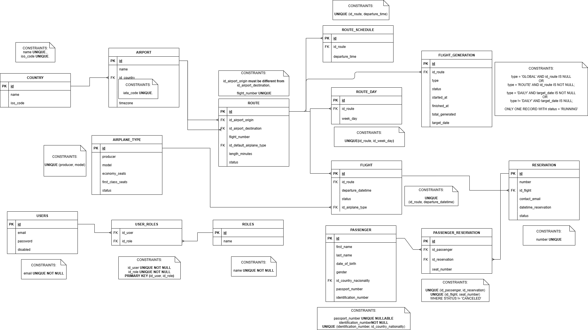
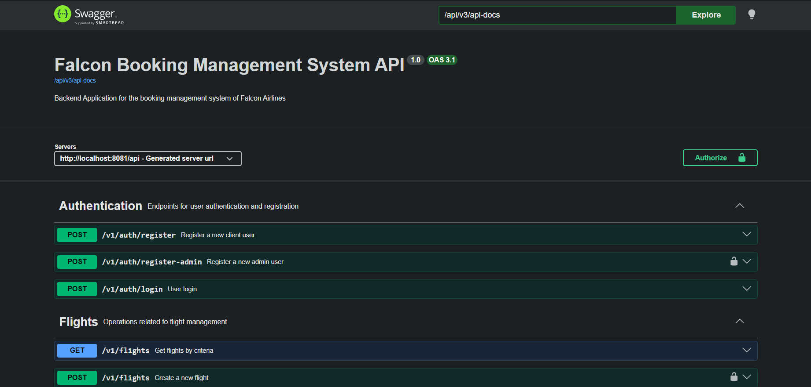

# Falcon Airlines - Flight Reservation System (Backend)

Backend application for the flight management system of Falcon Airlines, a fictional airline company. The system manages routes, flights, seat availability, reservations, and admin operations. It is designed as a portfolio-ready backend focused on maintainability, domain modeling, and real-world operational flows.

---

## Project Overview

The Flight Reservation System handles:

- Country and airport management
- Route and schedule definition
- Automatic and manual flight generation up to a configurable horizon
- Aircraft type and seat capacity management
- Seat availability and reservation logic
- Passenger information management
- Flight seat reservations
- Authentication and authorization for admin operations

This project is built as a modular monolith with a layered architecture and a clean architecture mindset, with emphasis on clarity, extensibility, and realistic airline domain rules.

---

## Highlights

- JWT-based authentication and role-based authorization for protected admin operations
- Automatic flight generation workflows with configurable planning horizon
- Reservation flow with passenger management and seat assignment rules
- Layered backend architecture separating web, domain, persistence, config, and security concerns
- Flyway-driven database versioning for reproducible schema evolution
- Dockerized packaging with a multi-stage build for reproducible deployment
- REST API documented with OpenAPI / Swagger UI
- Automated tests covering domain logic, controller behavior, and application context bootstrapping

---

## Architecture

The application follows a layered architecture inspired by MVC principles:

- **Web layer** - REST API endpoints and external communication
- **Domain layer** - Business logic and application rules
- **Persistence layer** - Data access using Spring Data JPA
- **Configuration layer** - Cross-cutting configuration such as Async and OpenAPI
- **Security layer** - Authentication and authorization using Spring Security and JWT

Key domain concepts:

- **Route:** Represents a flight path between two airports
- **RouteSchedule:** Days and times when a route is operated
- **Flight:** A specific instance of a route on a given date
- **AirplaneType:** Defines aircraft configuration and seat capacity
- **Reservation:** Represents a booking for a specific flight and its passengers

---

## Tech Stack

- Java 21
- Maven
- Spring Boot 3
- Spring Data JPA
- Spring Security + JWT
- PostgreSQL
- Flyway
- Docker
- OpenAPI / Swagger UI
- JUnit 5 + Mockito

---

## Database

- Database schema is managed using Flyway versioned migrations
- No automatic schema generation is intended for production environments
- Entities are aligned with migration scripts

## Entity Relationship Diagram

The following diagram represents the core data model of the Falcon Booking System.



---

## How to Run

### Prerequisites

- Docker
- PostgreSQL running locally or remotely

### Environment Variables

Set the following variables before starting the application or container:

```bash
DB_URL=jdbc:postgresql://localhost:5432/falcon_booking
DB_USER=your_db_user
DB_PASSWORD=your_db_password
```

### Domain Configuration

Part of the business behavior is intentionally configured through
[`application.properties`](/C:/Users/camil/Documents/Projects/Airline%20Booking%20Mangement%20System/falcon-booking-api/src/main/resources/application.properties)
instead of being hardcoded. This makes the system easier to adapt to different operational rules without changing source code.

#### Authentication and Admin Bootstrap

- `app.admin.email`
  Default admin email used during application bootstrap.
- `app.admin.password`
  Default admin password used during application bootstrap.
- `app.jwt.secret-key`
  Secret key used to sign and validate JWT tokens.
- `app.jwt.issuer`
  Logical issuer name embedded in generated JWT tokens.
- `app.jwt.expiration-ms`
  Token lifetime in milliseconds.

#### Flight Generation Rules

- `app.generation.horizon-days`
  Maximum number of days ahead for which flights can be generated automatically.
- `app.generation.batch-size`
  Number of flight records processed per batch during generation workflows.
- `app.generation.minimum-hours-before-departure`
  Minimum time window required before departure for operational generation rules to allow creating flights.

#### Operational Flight Status Rules

- `app.flight.status.update-rate-ms`
  Frequency, in milliseconds, used by the status update process for checking whether flights should transition between operational states.
- `app.flight.check-in.hours-before-to-start`
  Number of hours before departure when check-in becomes available.
- `app.flight.check-in.hours-before-to-close`
  Number of hours before departure when check-in closes.
- `app.flight.boarding.minutes-before-to-start`
  Number of minutes before departure when boarding starts.
- `app.flight.boarding.minutes-before-to-close`
  Number of minutes before departure when boarding closes.

These properties are useful to show recruiters that core domain rules were designed to be configurable and environment-driven, rather than hidden inside service implementations.

### Run with Docker

Build the image:

```bash
docker build -t falcon-booking-api .
```

Run the container:

```bash
docker run --rm -p 8080:8080 \
  -e DB_URL=jdbc:postgresql://host.docker.internal:5432/falcon_booking \
  -e DB_USER=your_db_user \
  -e DB_PASSWORD=your_db_password \
  falcon-booking-api
```

The project uses a multi-stage Docker build:

- the build stage packages the application with Maven
- the runtime stage runs the generated JAR on a Java 21 JRE image

This is the most convenient way to demo the project because it avoids requiring a local Java or Maven installation beyond Docker itself.

### Run Locally Without Docker

If you want to run it directly on your machine instead:

Windows:

```powershell
.\mvnw.cmd spring-boot:run
```

Linux / macOS:

```bash
./mvnw spring-boot:run
```

By default, the application runs with the `dev` profile.

### Local API Documentation

Once the application is running, Swagger UI should be available at:

```text
http://localhost:8080/api/swagger-ui/index.html
```

OpenAPI JSON should be available at:

```text
http://localhost:8080/api/v3/api-docs
```

### Run Tests

```bash
./mvnw test
```

On Windows:

```powershell
.\mvnw.cmd test
```

---

## API Documentation

Interactive API documentation is available through Swagger UI.

### Live Swagger
[Open Swagger UI](https://tu-url/swagger-ui/index.html)

Note: the application is deployed on a free-tier service, so the first request may take a couple of minutes while the instance wakes up.

### Preview


### Documentation Links

- Swagger UI: `https://tu-url/swagger-ui/index.html`
- OpenAPI JSON: `https://tu-url/v3/api-docs`

For recruiter-facing presentation, the best combination is:

- a live Swagger link so the project can be verified
- a screenshot so the API is understandable immediately
- a short note about free-tier cold start behavior

---

This project is for educational and portfolio purposes.

---

## Author

Juan Camilo Londono  
Backend Developer (Java / Spring Boot)
